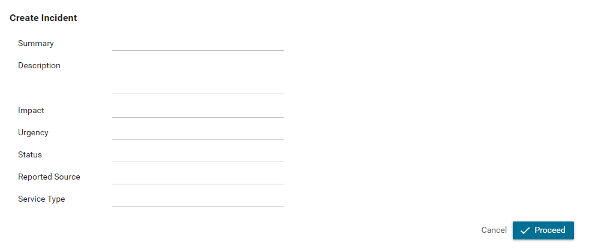
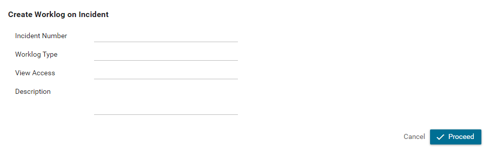

# BMC ITSM Connector

Axon Ivy's [BMC ITSM Connector ](https://www.bmcsoftware.de/it-solutions/bmc-helix-itsm.html) gives you full power to track incidents within your process work. The connector:

- Features five main functionalities (create incident, read incident, create worklog, read worklog and read worklogs of an incident).
- Provides access to the core API of BMC ITSM.
- Supports you with an easy-to-copy demo implementation to reduce your integration effort.
- Enables low code citizen developers to integrate incident tracking tools without writing a single line of code.

## Demo




## Setup

Open the `Config/variables.yaml` in your Axon Ivy Designer and paste the
code below and adjust the values to your environment.

```
Variables:
  bmc-itsm-connector:
  
    # Url to the BMC ITSM server
    Url: "https://localhost"
    # Username to connect to the BMC ITSM server
    Username: "admin"
    # Password to connect to the BMC ITSM server
    Password: "1234"
```